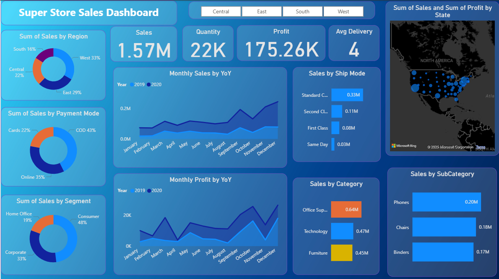
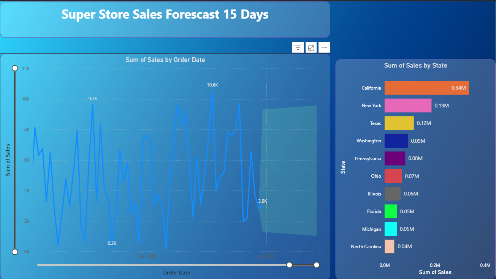

# SuperStore Sales Dashboard

A comprehensive Power BI analytics solution for retail sales data visualization and business intelligence.

## 📊 Project Overview

This project demonstrates an end-to-end sales analytics pipeline using Power BI to analyze SuperStore sales data. The dashboard provides actionable insights for business decision-making through interactive visualizations, KPI tracking, and sales forecasting.

### 🎯 Business Objectives

- **Data Integration**: Import, clean, and model raw sales transaction data
- **KPI Development**: Build calculated metrics and advanced DAX measures
- **Trend Analysis**: Visualize sales patterns and identify top performers
- **Forecasting**: Predict future sales trends for strategic planning
- **Business Intelligence**: Provide actionable insights for growth optimization

## 🗂️ Repository Structure

```
superstore-sales-dashboard/
├── SuperStore_Sales_Dataset.csv    # Raw sales data
├── dashboard.pbix                   # Power BI dashboard file
├── salesdashboard.png              # Main dashboard screenshot
├── salesforecast.png               # Sales forecast visualization
├── Superstore sales analysis.pdf   # Detailed project documentation
└── README.md                       # Project documentation
```

## 📁 Dataset Description

The **SuperStore Sales Dataset** is a comprehensive CSV file containing transaction-level retail sales data with the following key attributes:

### 🔑 Key Columns
- **Temporal Data**: Order Date, Ship Date, Ship Mode
- **Customer Information**: Customer Name, Segment (Consumer, Corporate, Home Office)
- **Geographic Data**: State, City, Region, Country
- **Product Details**: Category, Sub-Category, Product Name
- **Financial Metrics**: Sales, Quantity, Profit, Returns, Payment Mode

### 📈 Data Scope
- **Time Period**: 2019-2020 sales data
- **Geographic Coverage**: United States (4 regions: West, East, Central, South)
- **Product Categories**: Office Supplies, Technology, Furniture
- **Customer Segments**: Consumer (48%), Corporate (33%), Home Office (19%)

## 🔍 Business Questions Addressed

1. **Performance Metrics**: What are the total sales, profit, and quantity trends?
2. **Geographic Analysis**: Which states and regions drive top performance?
3. **Temporal Patterns**: What are peak months and seasonal trends?
4. **Profitability**: Where are returns and discounts impacting profit margins?
5. **Customer Behavior**: Which payment modes and segments dominate?
6. **Forecasting**: What are the projected sales for upcoming periods?

## 🛠️ Technical Implementation

### Data Processing Pipeline
1. **Data Import**: CSV file imported into Power BI Desktop
2. **Data Cleaning**: Handled null values, standardized formats, fixed data type mismatches
3. **Data Modeling**: Established relationships between Sales ↔ Product ↔ Customer ↔ Region tables
4. **Quality Assurance**: Ensured unique Order IDs and correct categorical mappings

### 📊 Key Metrics & DAX Calculations

```dax
// Core Metrics
Total Sales = SUM(Sales[Sales])
Total Profit = SUM(Sales[Profit])
Total Quantity = SUM(Sales[Quantity])

// Advanced Calculations
Profit Margin % = DIVIDE([Total Profit], [Total Sales]) * 100
Sales Growth % = [Current Period Sales] / [Previous Period Sales] - 1
Average Discount = AVERAGE(Sales[Discount])
```

## 📈 Dashboard Features

### Main Dashboard Overview


**Key Performance Indicators**:
- **Total Sales**: $1.57M
- **Total Quantity**: 22K units
- **Total Profit**: $175.26K
- **Average Delivery**: 4 days

### 🗺️ Geographic Analysis
- **Interactive Map**: Visual representation of sales and profit by state
- **Top Performing States**: California, New York, Texas leading in revenue
- **Regional Distribution**: West (33%), East (29%), Central (22%), South (16%)

### 📅 Temporal Analysis
- **Monthly Sales Trends**: Year-over-Year comparison (2019 vs 2020)
- **Seasonal Patterns**: Peak performance in November-December
- **Monthly Profit Tracking**: Identifying profitability cycles

### 🔮 Sales Forecasting


- **15-Day Sales Forecast**: Predictive analytics using Power BI's built-in forecasting
- **State-wise Projections**: California leading with $0.34M forecasted sales
- **Trend Analysis**: Historical data patterns for future planning

### 📊 Customer & Product Analytics
- **Payment Preferences**: COD (43%), Online (35%), Cards (22%)
- **Customer Segments**: Consumer-focused market with growth opportunities in Corporate and Home Office
- **Product Performance**: Top categories by sales volume and profitability
- **Shipping Analysis**: Performance by delivery modes

## 🎛️ Interactive Features

- **Dynamic Filtering**: Slicers for Region, State, Time Period, Product Category
- **Drill-down Capabilities**: Granular analysis from region to state to city level
- **Real-time Updates**: KPIs automatically update based on filter selections
- **Cross-filtering**: Interactive visual relationships for comprehensive analysis

## 💡 Key Business Insights

### 🏆 Performance Highlights
- **Geographic Leaders**: California, New York, and Texas drive majority of revenue
- **Seasonal Opportunity**: 20% higher sales in Q4 - optimize inventory and campaigns
- **Payment Behavior**: COD preference suggests opportunity for digital payment incentives

### 📋 Strategic Recommendations
1. **Geographic Expansion**: Focus marketing efforts on high-performing regions
2. **Segment Development**: Expand Corporate and Home Office customer acquisition
3. **Seasonal Planning**: Prepare inventory and staffing for Q4 demand surge
4. **Payment Innovation**: Introduce incentives for card/online payments
5. **Forecasting Utilization**: Use 15-day projections for proactive supply planning

## 🔧 Technical Requirements

### Software & Tools
- **Power BI Desktop**: Dashboard development and data modeling
- **Microsoft Excel**: Data preprocessing (optional)
- **DAX**: Advanced calculations and measures

### System Requirements
- Windows 10 or later
- Power BI Desktop (latest version)
- Minimum 4GB RAM for optimal performance

## 🚀 Getting Started

1. **Clone Repository**:
   ```bash
   git clone https://github.com/yourusername/superstore-sales-dashboard.git
   ```

2. **Open Power BI File**:
   - Launch Power BI Desktop
   - Open `dashboard.pbix`

3. **Data Refresh**:
   - Ensure `SuperStore_Sales_Dataset.csv` is in the same directory
   - Refresh data if needed

4. **Explore Dashboard**:
   - Use slicers and filters for interactive analysis
   - Drill down into specific regions or time periods

## 📚 Project Learnings

### Technical Skills Developed
- **Advanced Power BI**: Data modeling, DAX functions, dashboard design
- **Business Intelligence**: KPI development, forecasting, trend analysis
- **Data Visualization**: Interactive charts, geographic mapping, time series analysis

### Business Acumen
- **Retail Analytics**: Understanding sales patterns and customer behavior
- **Strategic Planning**: Using data insights for business recommendations
- **Performance Monitoring**: Establishing metrics for ongoing business evaluation

## 🤝 Contributing

Contributions are welcome! Please feel free to submit a Pull Request. For major changes, please open an issue first to discuss what you would like to change.

## 📄 License

This project is open source


## 🙏 Acknowledgments

- SuperStore dataset for providing comprehensive retail sales data
- Power BI community for excellent documentation and tutorials
- Microsoft for the powerful business intelligence platform

---

⭐ **Star this repository if you found it helpful!**

*This project demonstrates practical application of business intelligence tools for real-world data analysis and decision-making support.*
